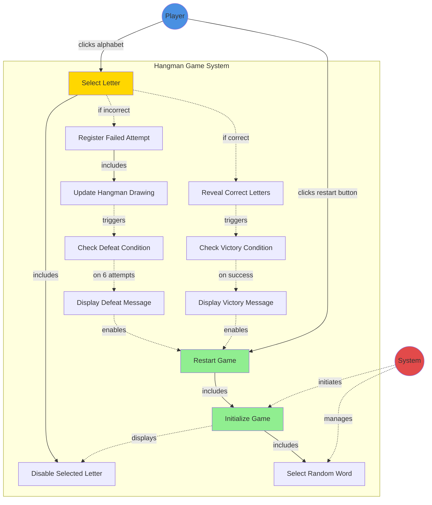

# Initial

I've created a UML use case diagram for the Hangman game application. Here's what the diagram represents:

**Actors:**

- **Player**: The human user who interacts with the game by selecting letters and restarting games
- **System**: The automated system that manages game logic and state

**Main Use Cases:**

1. **Initialize Game** - Sets up a new game with a random word
2. **Select Letter** - Player clicks on an alphabet letter
3. **Reveal Correct Letters** - Shows all occurrences of a correct letter
4. **Register Failed Attempt** - Increments the counter for wrong guesses
5. **Update Hangman Drawing** - Adds a new part to the hangman (6 progressive states)
6. **Check Victory Condition** - Determines if player has won
7. **Check Defeat Condition** - Determines if player has lost (6 failed attempts)
8. **Display Victory/Defeat Messages** - Shows game outcome
9. **Restart Game** - Resets the game with a new word
10. **Disable Selected Letter** - Prevents re-selection of used letters
11. **Select Random Word** - Chooses a word from the animal dictionary

**Relationships:**

- Solid arrows (→) show actor-to-use-case associations
- Dashed arrows with "includes" show mandatory dependencies
- Dashed arrows with conditions show conditional flows

The diagram captures all functional requirements (FR1-FR10) from your specification, showing the complete game flow from initialization through letter selection to game completion and restart.

