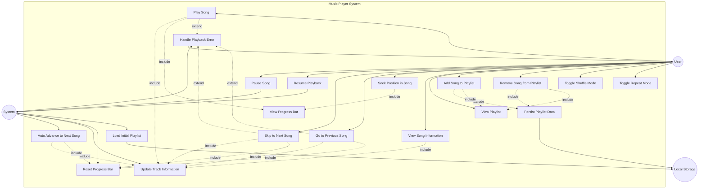

# Initial

I've created a comprehensive UML use case diagram for the music player application. Here's what it includes:

**Main Actors:**

- **User**: The person interacting with the music player
- **System**: Automated system processes
- **Local Storage**: Persistent data storage

**Primary Use Cases (User-Initiated):**

1. **Play Song** - Start playback from beginning or current position
2. **Pause Song** - Stop playback temporarily
3. **Resume Playback** - Continue from paused position
4. **Skip to Next Song** - Move to next track in playlist
5. **Go to Previous Song** - Return to previous track
6. **Seek Position in Song** - Jump to specific time via progress bar
7. **View Song Information** - See title, artist, cover art
8. **View Playlist** - Display all available songs
9. **Add Song to Playlist** - Include new track
10. **Remove Song from Playlist** - Delete track from list
11. **Toggle Shuffle Mode** - Enable/disable random playback
12. **Toggle Repeat Mode** - Enable/disable song/playlist repeat

**Included Use Cases (Dependencies):**

- **Update Track Information** - Refresh displayed song data
- **Reset Progress Bar** - Return progress to start
- **Persist Playlist Data** - Save changes to localStorage
- **Load Initial Playlist** - Retrieve stored playlist on startup

**Extended Use Cases (Conditional):**

- **Handle Playback Error** - Manage audio file issues
- **Auto Advance to Next Song** - Automatic track progression

**System Use Cases:**

- **View Progress Bar** - Real-time playback position display

The diagram shows how users interact with the core playback features, playlist management, and how the system automatically handles tasks like track updates and error management. All data persistence flows through Local Storage, ensuring playlist changes are maintained across sessions.

