# Initial

I've created a comprehensive UML use case diagram for the Music Player application based on your requirements. The diagram includes:

## **Actors:**

- **User**: The person interacting with the music player
- **System/Browser**: The application executing background operations

## **Use Case Categories:**

1. **Core Playback (Yellow)**: Play, Pause, Next, Previous, Seek, and Auto-play functionality
2. **Visualization (Orange)**: Display of song information, cover art, progress, and playlist
3. **Playlist Management (Purple)**: Add, remove, and persist playlist operations
4. **Optional Features (Blue)**: Shuffle, repeat, history, and theme switching
5. **System Operations (Light Purple)**: Load playlist, update UI, validate data, manage song data
6. **Error Handling (Red)**: Handle playback errors and display error messages

## **Key Relationships:**

- **Include relationships** (dotted lines `.->`) show dependencies between use cases
- **Extend relationships** (dotted lines `..->`) show optional or conditional behaviors
- All user interactions flow through the User actor
- System operations are triggered automatically by the System/Browser actor

The diagram maps all 65 requirements from your specification into logical use cases with proper relationships and color-coding for easy identification of functionality groups.

```mermaid
graph TB
    User((User))
    System((System/Browser))
    
    %% Core Playback Use Cases
    PlaySong[Play Song]
    PauseSong[Pause Playback]
    NextSong[Skip to Next Song]
    PrevSong[Return to Previous Song]
    SeekPosition[Seek to Position]
    AutoPlayNext[Auto-play Next Song]
    
    %% Visualization Use Cases
    ViewSongInfo[View Song Information]
    ViewCoverArt[View Cover Art]
    ViewProgress[View Playback Progress]
    ViewPlaylist[View Playlist]
    ViewElapsedTime[View Elapsed Time]
    ViewTotalDuration[View Total Duration]
    
    %% Playlist Management Use Cases
    AddSong[Add Song to Playlist]
    RemoveSong[Remove Song from Playlist]
    ManagePlaylist[Manage Playlist]
    PersistPlaylist[Persist Playlist Data]
    
    %% Optional Enhanced Features
    ShufflePlayback[Shuffle Playback]
    RepeatMode[Repeat Mode]
    ViewHistory[View Playback History]
    SwitchTheme[Switch Theme]
    
    %% System Use Cases
    LoadPlaylist[Load Playlist]
    UpdateUI[Update User Interface]
    ValidateSongData[Validate Song Data]
    HandlePlaybackError[Handle Playback Error]
    UpdateProgressBar[Update Progress Bar]
    DisplayErrorMessage[Display Error Message]
    LoadAudioFile[Load Audio File]
    ManageSongData[Manage Song Data]
    
    %% User interactions - Core Playback
    User -->|clicks play| PlaySong
    User -->|clicks pause| PauseSong
    User -->|clicks next| NextSong
    User -->|clicks previous| PrevSong
    User -->|clicks progress bar| SeekPosition
    User -->|views| ViewSongInfo
    User -->|views| ViewCoverArt
    User -->|views| ViewProgress
    User -->|views| ViewPlaylist
    
    %% User interactions - Playlist Management
    User -->|adds| AddSong
    User -->|removes| RemoveSong
    User -->|manages| ManagePlaylist
    
    %% User interactions - Optional Features
    User -->|activates| ShufflePlayback
    User -->|activates| RepeatMode
    User -->|views| ViewHistory
    User -->|switches| SwitchTheme
    
    %% System interactions
    System -->|executes| LoadPlaylist
    System -->|performs| UpdateUI
    System -->|validates| ValidateSongData
    System -->|handles| HandlePlaybackError
    System -->|maintains| ManageSongData
    System -->|triggers| AutoPlayNext
    
    %% Include relationships - Core Playback
    PlaySong -.->|includes| LoadAudioFile
    PlaySong -.->|includes| UpdateUI
    
    PauseSong -.->|includes| UpdateUI
    
    NextSong -.->|includes| LoadAudioFile
    NextSong -.->|includes| UpdateUI
    NextSong -.->|includes| UpdateProgressBar
    
    PrevSong -.->|includes| LoadAudioFile
    PrevSong -.->|includes| UpdateUI
    PrevSong -.->|includes| UpdateProgressBar
    
    SeekPosition -.->|includes| UpdateProgressBar
    SeekPosition -.->|includes| UpdateUI
    
    %% Include relationships - Visualization
    ViewSongInfo -.->|includes| ViewCoverArt
    ViewSongInfo -.->|includes| ViewElapsedTime
    ViewSongInfo -.->|includes| ViewTotalDuration
    
    ViewProgress -.->|includes| UpdateProgressBar
    
    %% Include relationships - Playlist Management
    ManagePlaylist -.->|includes| AddSong
    ManagePlaylist -.->|includes| RemoveSong
    
    AddSong -.->|includes| ValidateSongData
    AddSong -.->|includes| PersistPlaylist
    AddSong -.->|includes| UpdateUI
    
    RemoveSong -.->|includes| PersistPlaylist
    RemoveSong -.->|includes| UpdateUI
    
    PersistPlaylist -.->|includes| ManageSongData
    
    %% Include relationships - System Operations
    LoadPlaylist -.->|includes| ValidateSongData
    LoadPlaylist -.->|includes| ManageSongData
    LoadPlaylist -.->|includes| UpdateUI
    
    LoadAudioFile -.->|includes| ValidateSongData
    
    %% Extend relationships - Error Handling
    LoadAudioFile ..->|extends| HandlePlaybackError
    PlaySong ..->|extends| HandlePlaybackError
    
    HandlePlaybackError -.->|includes| DisplayErrorMessage
    HandlePlaybackError -.->|includes| UpdateUI
    
    %% Extend relationships - Auto-play
    PlaySong ..->|extends| AutoPlayNext
    AutoPlayNext -.->|includes| NextSong
    
    %% Extend relationships - Optional Features
    NextSong ..->|extends| ShufflePlayback
    RepeatMode ..->|extends| PlaySong
    
    %% Styling
    classDef userStyle fill:#4A90E2,stroke:#2E5C8A,stroke-width:3px,color:#fff
    classDef systemStyle fill:#50C878,stroke:#2E7D4E,stroke-width:3px,color:#fff
    classDef coreUseCase fill:#FFD700,stroke:#DAA520,stroke-width:2px
    classDef visualUseCase fill:#FF9F40,stroke:#CC7A33,stroke-width:2px
    classDef playlistUseCase fill:#9B59B6,stroke:#6C3483,stroke-width:2px
    classDef optionalUseCase fill:#3498DB,stroke:#2471A3,stroke-width:2px
    classDef systemUseCase fill:#B19CD9,stroke:#7B68A8,stroke-width:2px
    classDef errorUseCase fill:#FF6B6B,stroke:#C92A2A,stroke-width:2px
    
    class User userStyle
    class System systemStyle
    class PlaySong,PauseSong,NextSong,PrevSong,SeekPosition,AutoPlayNext coreUseCase
    class ViewSongInfo,ViewCoverArt,ViewProgress,ViewPlaylist,ViewElapsedTime,ViewTotalDuration visualUseCase
    class AddSong,RemoveSong,ManagePlaylist,PersistPlaylist playlistUseCase
    class ShufflePlayback,RepeatMode,ViewHistory,SwitchTheme optionalUseCase
    class LoadPlaylist,UpdateUI,ValidateSongData,UpdateProgressBar,LoadAudioFile,ManageSongData systemUseCase
    class HandlePlaybackError,DisplayErrorMessage errorUseCase
```

