# Initial

I've created a comprehensive UML use case diagram for the Music Player application. Here's what the diagram represents:

**Actors:**

- **User**: The person interacting with the music player to control playback and manage playlists
- **System**: The automated system handling audio playback, data persistence, and error management

**Use Case Groups:**

1. **Playback Control** (FR1-FR5, FR20):
    - Play, Pause, Resume, Next, Previous Song
    - Toggle Play/Pause State for button visualization
2. **Information Display** (FR6-FR11):
    - Update Track Information (coordinates all display updates)
    - Display Title, Artist, Cover, Elapsed Time, Total Duration
3. **Progress Control** (FR10-FR13):
    - Update Progress Bar in real-time
    - Seek to Position via bar interaction
4. **Playlist Management** (FR14-FR19):
    - Display, Add, Remove Songs
    - Save/Load Playlist to/from Storage (localStorage)
    - Update Playlist UI in real-time
5. **Error Handling** (NFR9, NFR12, NFR13):
    - Handle Playback Errors
    - Display Error Messages
    - Validate Audio Files

**Relationships:**

- Solid arrows (→) show direct user actions
- Dashed arrows (-.→) show system-initiated actions or conditional flows
- "includes" relationships show mandatory dependencies between use cases

The diagram captures all 20 functional requirements and represents the complete user journey from playback control through playlist management with proper error handling.

```mermaid
graph TB
    subgraph "Music Player Application"
        subgraph "Playback Control"
            UC1[Play Song]
            UC2[Pause Playback]
            UC3[Resume Playback]
            UC4[Next Song]
            UC5[Previous Song]
            UC20[Toggle Play/Pause State]
        end
        
        subgraph "Information Display"
            UC6[Update Track Information]
            UC7[Display Song Title]
            UC8[Display Artist Name]
            UC9[Display Cover Image]
            UC10[Display Elapsed Time]
            UC11[Display Total Duration]
        end
        
        subgraph "Progress Control"
            UC12[Update Progress Bar]
            UC13[Seek to Position]
        end
        
        subgraph "Playlist Management"
            UC14[Display Playlist]
            UC15[Add Song to Playlist]
            UC16[Remove Song from Playlist]
            UC17[Save Playlist to Storage]
            UC18[Load Playlist from Storage]
            UC19[Update Playlist UI]
        end
        
        subgraph "Error Handling"
            UC21[Handle Playback Error]
            UC22[Display Error Message]
            UC23[Validate Audio File]
        end
    end
    
    User((User))
    System((System))
    
    User -->|clicks play| UC1
    User -->|clicks pause| UC2
    User -->|clicks next| UC4
    User -->|clicks previous| UC5
    User -->|clicks progress bar| UC13
    User -->|adds song| UC15
    User -->|removes song| UC16
    User -->|views| UC14
    
    System -.->|manages| UC17
    System -.->|initializes| UC18
    System -.->|monitors| UC21
    
    UC1 -->|includes| UC20
    UC1 -.->|triggers| UC6
    UC1 -.->|starts| UC12
    
    UC2 -->|includes| UC20
    UC2 -.->|maintains position| UC10
    
    UC3 -->|includes| UC1
    UC3 -->|includes| UC20
    
    UC4 -->|includes| UC6
    UC4 -.->|resets| UC12
    
    UC5 -->|includes| UC6
    UC5 -.->|resets| UC12
    
    UC6 -->|includes| UC7
    UC6 -->|includes| UC8
    UC6 -->|includes| UC9
    UC6 -->|includes| UC11
    
    UC12 -->|includes| UC10
    UC12 -.->|updates| UC11
    
    UC13 -.->|updates| UC12
    UC13 -.->|changes| UC10
    
    UC15 -->|includes| UC19
    UC15 -->|includes| UC17
    UC15 -.->|validates| UC23
    
    UC16 -->|includes| UC19
    UC16 -->|includes| UC17
    
    UC18 -.->|loads to| UC14
    
    UC21 -->|includes| UC22
    UC21 -.->|may trigger| UC4
    
    UC23 -.->|on failure| UC22
    
    style User fill:#4A90E2
    style System fill:#E24A4A
    style UC1 fill:#90EE90
    style UC15 fill:#FFD700
    style UC16 fill:#FFD700
    style UC21 fill:#FF6B6B
```

