# Initial

I've created a comprehensive UML use case diagram for the Balatro-inspired card game. Here's the breakdown:

**Main Actors:**

- **Player**: The human user playing the game
- **System**: Automated game logic and mechanics
- **Local Storage**: Persistent game state storage

**Primary Player Use Cases:**

*Game Management:*

1. **Start New Game** - Initialize a new game session
2. **Continue Saved Game** - Resume from saved progress
3. **View Help Information** - Access game rules and mechanics

*Gameplay Actions:*
4. **Select Cards to Play** - Choose up to 5 cards from hand
5. **Play Poker Hand** - Submit selected cards for scoring
6. **Discard Cards** - Replace unwanted cards (up to 3 times)
7. **Use Tarot Card** - Activate consumable card effects
8. **View Hand Information** - See current hand details

*Shop Actions:*
9. **Enter Shop** - Access shop after level completion
10. **Purchase Joker Card** - Buy permanent joker effects
11. **Purchase Planet Card** - Buy hand upgrades
12. **Purchase Tarot Card** - Buy consumable effects
13. **Reroll Shop** - Generate new shop inventory
14. **Exit Shop** - Continue to next level

**System Use Cases:**

*Core Mechanics:*

- **Calculate Score** - Apply poker hand scoring formula (chips × mult)
- **Apply Joker Effects** - Process persistent joker bonuses
- **Apply Card Synergies** - Handle multiple joker interactions
- **Apply Planet Upgrade** - Permanently improve hand levels
- **Apply Tarot Effect** - Execute tarot card effects
- **Modify Deck Permanently** - Add/remove cards from deck

*Game Flow:*

- **Deal Initial Hand** - Provide 8 cards at level start
- **Replace Discarded Cards** - Draw new cards from deck
- **Check Level Completion** - Verify win/loss conditions
- **Complete Level** - Process successful level clear
- **Award Money** - Grant currency based on blind type
- **Progress to Next Level** - Advance through game stages
- **Activate Boss Effect** - Apply boss blind restrictions (every 3rd level)

*End Conditions:*

- **Handle Victory** - Process game completion
- **Handle Defeat** - Process game failure

*Persistence:*

- **Save Game Progress** - Store current state to localStorage

**Key Relationships:**

- **Include dependencies** show mandatory sub-processes (e.g., Playing Hand includes Calculate Score, Apply Joker Effects, and Apply Card Synergies)
- **Extend relationships** show conditional outcomes (e.g., Checking Level Completion can extend to either Complete Level or Handle Defeat)
- Boss Effects are conditionally activated during Progress to Next Level (every 3rd level)
- Shop flow is integrated into level completion sequence
- All purchase and progression actions trigger Save Game Progress

The diagram captures the complete game loop: dealing cards → playing/discarding hands → scoring → level completion → shopping → progression, with proper handling of the three hand types (main, joker, consumable) and special mechanics (bosses, synergies, permanent modifications).

```mermaid
graph TB
    subgraph "Balatro Card Game System"
        UC1[Start New Game]
        UC2[Continue Saved Game]
        UC3[Select Cards to Play]
        UC4[Play Poker Hand]
        UC5[Discard Cards]
        UC6[Use Tarot Card]
        UC7[View Hand Information]
        UC8[Complete Level]
        UC9[Enter Shop]
        UC10[Purchase Joker Card]
        UC11[Purchase Planet Card]
        UC12[Purchase Tarot Card]
        UC13[Reroll Shop]
        UC14[Exit Shop]
        UC15[Progress to Next Level]
        UC16[Calculate Score]
        UC17[Apply Joker Effects]
        UC18[Apply Planet Upgrade]
        UC19[Apply Tarot Effect]
        UC20[Deal Initial Hand]
        UC21[Replace Discarded Cards]
        UC22[Check Level Completion]
        UC23[Award Money]
        UC24[Activate Boss Effect]
        UC25[Handle Victory]
        UC26[Handle Defeat]
        UC27[Save Game Progress]
        UC28[View Help Information]
        UC29[Apply Card Synergies]
        UC30[Modify Deck Permanently]
        UC31[Upgrade Hand Level]
    end
    
    Player((Player))
    System((System))
    Storage((Local Storage))
    
    Player --> UC1
    Player --> UC2
    Player --> UC3
    Player --> UC4
    Player --> UC5
    Player --> UC6
    Player --> UC7
    Player --> UC9
    Player --> UC10
    Player --> UC11
    Player --> UC12
    Player --> UC13
    Player --> UC14
    Player --> UC28
    
    UC1 -.->|include| UC20
    UC1 -.->|include| UC27
    
    UC2 --> Storage
    
    UC3 --> Player
    
    UC4 -.->|include| UC16
    UC4 -.->|include| UC17
    UC4 -.->|include| UC29
    UC4 -.->|include| UC22
    
    UC5 -.->|include| UC21
    
    UC6 -.->|include| UC19
    UC6 -.->|extend| UC30
    
    UC16 -.->|include| UC17
    UC16 -.->|include| UC29
    
    UC22 -.->|extend| UC8
    UC22 -.->|extend| UC26
    
    UC8 -.->|include| UC23
    UC8 -.->|include| UC9
    UC8 -.->|include| UC27
    
    UC9 --> System
    
    UC10 -.->|include| UC27
    UC11 -.->|include| UC18
    UC11 -.->|include| UC31
    UC11 -.->|include| UC27
    UC12 -.->|include| UC27
    
    UC13 -.->|include| UC27
    
    UC14 -.->|include| UC15
    
    UC15 -.->|include| UC20
    UC15 -.->|extend| UC24
    UC15 -.->|include| UC27
    
    UC18 -.->|include| UC31
    
    UC19 -.->|extend| UC30
    
    UC25 --> Player
    UC26 --> Player
    
    System --> UC16
    System --> UC17
    System --> UC20
    System --> UC21
    System --> UC22
    System --> UC23
    System --> UC24
    System --> UC25
    System --> UC26
    System --> UC27
    System --> UC29
    System --> UC30
    System --> UC31
    
    UC27 --> Storage
```

