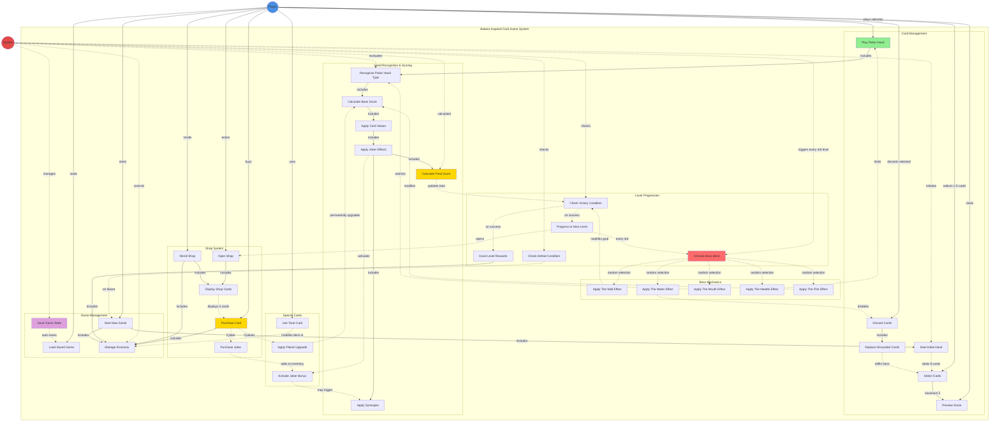

# Initial

I've created a comprehensive UML use case diagram for the Balatro-inspired card game. Here's what the diagram represents:

**Actors:**

- **Player**: The human user who plays poker hands, manages cards, purchases items, and makes strategic decisions
- **System**: The automated system handling game logic, calculations, level progression, and persistence

**Use Case Groups:**

1. **Card Management** (FR1-FR6, FR30):
    - Deal, Select, Play, Discard cards
    - Preview Score before playing
    - Hand size management (8 cards max, 5 selectable)
2. **Hand Recognition & Scoring** (FR3, FR7-FR8, FR16):
    - Recognize poker hand types
    - Calculate scores with strict order: base → card values → joker effects
    - Apply synergies when multiple jokers trigger
3. **Level Progression** (FR9-FR11, FR18):
    - Check victory/defeat conditions
    - Progress through Small/Big/Boss Blinds
    - Grant monetary rewards
4. **Shop System** (FR19-FR21):
    - Display 4 random cards
    - Purchase jokers ($5), planets ($3), tarot ($3)
    - Reroll shop inventory
5. **Special Cards** (FR13-FR15):
    - Planet cards (permanent hand upgrades)
    - Tarot cards (consumable effects)
    - Joker cards (persistent bonuses)
6. **Boss Mechanics** (FR22-FR27):
    - Five boss types with unique restrictions
    - Applied every third level
7. **Game Management** (FR17, FR28-FR29):
    - Save/Load game state
    - Economy management ($5 starting money)
    - New game initialization

**Key Relationships:**

- Solid arrows (→) show direct player interactions
- Dashed arrows (-.→) show system-triggered or conditional flows
- "includes" shows mandatory dependencies between use cases

The diagram captures all 35 functional requirements, emphasizing the complex scoring system with strict calculation order, the three-tiered level structure, and the strategic depth of managing three card types simultaneously.

