# Initial

I've created a comprehensive UML use case diagram for the cartographic project management application. Here's the breakdown:

**Main Actors:**

- **Administrator**: Professional cartographer with full system control
- **Client**: User with limited permissions to assigned projects
- **Special User**: User with customizable permissions per project
- **System**: Automated processes and services
- **Dropbox API**: External cloud storage service
- **WhatsApp**: External notification service

**Use Cases by Category:**

**Project Management (Administrator):**

1. **Create Project** - Initialize new cartographic project
2. **Edit Project** - Modify project information
3. **Delete Project** - Remove project from system
4. **View Projects** - Access project list
5. **Mark Project as Completed** - Finalize project status

**Task Management (Administrator & Client):**
6. **Create Task** - Generate new task
7. **Edit Task** - Modify task details (Admin: any task; Client: any task in their projects)
8. **Delete Task** - Remove task (Admin: any task; Client: only own tasks)
9. **Assign Task** - Designate responsible user
10. **View Tasks** - Access task list
11. **Change Task Status** - Update task progress (Pending → In Progress → Partial → Done → Completed)
12. **Confirm Task Completion** - Approve finished tasks

**Communication:**
13. **Send Message** - Post project-specific messages
14. **View Messages** - Read project communications
15. **Attach File to Message** - Include documents in messages

**File Management (Integration with Dropbox):**
16. **Upload File to Cloud** - Store files in Dropbox
17. **Download File from Cloud** - Retrieve files from Dropbox
18. **View Project Files** - Access project documents (PDF, KML, SHP, photos)

**Visualization & Navigation:**
19. **View Main Dashboard** - Access project summary with color-coded status
20. **View Calendar** - Display projects by delivery dates
21. **View Project by Delivery Date** - Sort projects chronologically
22. **Filter Projects by Status** - Show red (pending tasks) or green (no pending tasks)
23. **View Unread Messages Count** - Display message indicators
24. **Access Project Details** - Open specific project information

**System Administration:**
25. **Configure User Permissions** - Set special user access levels (Administrator only)
26. **Export Project Data** - Generate reports (Administrator only)

**Automated System Processes:**
27. **Receive Notification** - Get alerts for messages, tasks, files, status changes
28. **Create Cloud Folder** - Auto-generate Dropbox folder for new projects
29. **Sync Data Real-time** - Keep information updated across devices

**Key Relationships:**

- **Include dependencies**: Mandatory sub-processes (e.g., Creating Project includes Create Cloud Folder)
- **Extend relationships**: Optional additions (e.g., Send Message can extend to Attach File to Message)
- **Role-based access**: Lines show which actors can perform which actions
- **External integrations**: Dropbox API for file operations, WhatsApp for optional notifications

**Permission Highlights:**

- **Administrator**: Full access to all use cases
- **Client**: Limited to assigned projects; can create/edit tasks, delete only own tasks
- **Special User**: Configurable access (typically view-only for projects, tasks, messages, files)

The diagram captures the complete workflow from project creation through task management, communication, file sharing, and notifications, with proper role separation and cloud service integration.

```mermaid
graph TB
    subgraph "Cartographic Project Management System"
        UC1[Create Project]
        UC2[Edit Project]
        UC3[Delete Project]
        UC4[View Projects]
        UC5[Mark Project as Completed]
        UC6[Create Task]
        UC7[Edit Task]
        UC8[Delete Task]
        UC9[Assign Task]
        UC10[View Tasks]
        UC11[Change Task Status]
        UC12[Confirm Task Completion]
        UC13[Send Message]
        UC14[View Messages]
        UC15[Attach File to Message]
        UC16[Upload File to Cloud]
        UC17[Download File from Cloud]
        UC18[View Project Files]
        UC19[View Main Dashboard]
        UC20[View Calendar]
        UC21[Configure User Permissions]
        UC22[Receive Notification]
        UC23[Create Cloud Folder]
        UC24[Sync Data Real-time]
        UC25[View Project by Delivery Date]
        UC26[Filter Projects by Status]
        UC27[View Unread Messages Count]
        UC28[Access Project Details]
        UC29[Export Project Data]
    end
    
    Admin((Administrator))
    Client((Client))
    SpecialUser((Special User))
    System((System))
    Dropbox((Dropbox API))
    WhatsApp((WhatsApp))
    
    Admin --> UC1
    Admin --> UC2
    Admin --> UC3
    Admin --> UC4
    Admin --> UC5
    Admin --> UC6
    Admin --> UC7
    Admin --> UC8
    Admin --> UC9
    Admin --> UC10
    Admin --> UC11
    Admin --> UC12
    Admin --> UC13
    Admin --> UC14
    Admin --> UC15
    Admin --> UC16
    Admin --> UC17
    Admin --> UC18
    Admin --> UC19
    Admin --> UC20
    Admin --> UC21
    Admin --> UC29
    
    Client --> UC4
    Client --> UC6
    Client --> UC7
    Client --> UC8
    Client --> UC9
    Client --> UC10
    Client --> UC11
    Client --> UC12
    Client --> UC13
    Client --> UC14
    Client --> UC15
    Client --> UC16
    Client --> UC17
    Client --> UC18
    Client --> UC19
    Client --> UC20
    
    SpecialUser --> UC4
    SpecialUser --> UC10
    SpecialUser --> UC14
    SpecialUser --> UC17
    SpecialUser --> UC18
    SpecialUser --> UC19
    
    UC1 -.->|include| UC23
    UC1 -.->|include| UC24
    
    UC2 -.->|include| UC24
    UC3 -.->|include| UC24
    
    UC4 -.->|include| UC25
    UC4 -.->|include| UC26
    UC4 -.->|include| UC27
    
    UC6 -.->|include| UC9
    UC6 -.->|include| UC11
    UC6 -.->|include| UC22
    UC6 -.->|include| UC24
    
    UC7 -.->|include| UC11
    UC7 -.->|include| UC22
    UC7 -.->|include| UC24
    
    UC8 -.->|include| UC22
    UC8 -.->|include| UC24
    
    UC11 -.->|include| UC22
    UC11 -.->|include| UC24
    
    UC12 -.->|include| UC22
    UC12 -.->|include| UC24
    
    UC13 -.->|include| UC22
    UC13 -.->|include| UC24
    UC13 -.->|extend| UC15
    
    UC15 -.->|include| UC16
    
    UC16 --> Dropbox
    UC17 --> Dropbox
    UC18 --> Dropbox
    UC23 --> Dropbox
    
    UC19 -.->|include| UC4
    UC19 -.->|include| UC27
    
    UC20 -.->|include| UC25
    UC20 -.->|include| UC26
    
    UC21 -.->|include| UC24
    
    UC22 -.->|extend| WhatsApp
    
    UC28 -.->|include| UC10
    UC28 -.->|include| UC14
    UC28 -.->|include| UC18
    
    System --> UC22
    System --> UC23
    System --> UC24
    System --> UC25
    System --> UC26
    System --> UC27
    
    UC22 --> Admin
    UC22 --> Client
    UC22 --> SpecialUser
```

