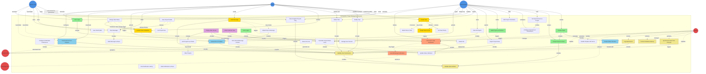

# Initial

I've created a comprehensive UML use case diagram for the Cartographic Project Management System following your specified format. The diagram includes:

**Key Features:**

- **50 use cases** organized by functional areas (Project Management, Task Management, Messaging, File Management, Notifications, Visualizations, Authentication, and System Management)
- **6 actors**: Administrator, Client, Special User, System, Dropbox API, and WhatsApp API
- **Relationship types**:
    - Solid arrows (-->) for direct user interactions and includes relationships
    - Dotted arrows (-.->) for system-managed actions, triggers, and conditional flows
- **Color coding**:
    - Actors: Blue for users, Red for system components
    - Use cases by category: Green (core project/auth), Gold (tasks/messaging), Sky Blue (files), Coral (notifications), Plum (visualizations), Khaki (system processes)

The diagram captures the complete workflow including:

- Differentiated role permissions (Administrator with full control, Client with limited access, Special User with configurable permissions)
- Bidirectional task assignment between administrator and clients
- Project messaging with file attachments
- Dropbox integration for file storage
- Automatic notification system (in-app and WhatsApp)
- Real-time synchronization and data isolation
- Visual status indicators and calendar views

Would you like me to create additional diagrams focusing on specific subsystems, or would you like any modifications to this diagram?

