# Initial

I've created a comprehensive UML use case diagram for the tennis tournament management system. Here's the detailed breakdown:

**Main Actors:**

- **System Administrator**: Complete platform control
- **Tournament Administrator**: Manages specific tournaments
- **Registered Participant**: Players with limited permissions to their data
- **Public User**: Read-only access to public information
- **System**: Automated processes
- **Email Service**: External notification service
- **Telegram API**: External messaging service

**Use Cases by Category:**

**Tournament Management (Admins):**

1. **Create Tournament** - Initialize new tournament with configuration
2. **Edit Tournament** - Modify tournament details
3. **Delete Tournament** - Remove tournament from system
4. **View Tournaments** - Access tournament list
5. **Mark Tournament Complete** - Finalize tournament
6. **Configure Tournament Settings** - Set categories, dates, quotas, regulations
7. **Manage Court Availability** - Define courts, schedules, and surface types

**Participant Management:**
8. **Register for Tournament** - Player signs up for competition
9. **Withdraw from Tournament** - Player exits before/during tournament
10. **Manage Participants** - Handle registrations and entries
11. **Manage Entry Status** - Assign DA, WC, QU, LL, ALT, WD, etc.
12. **Configure User Profile** - Set name, ranking, contact data, avatar
13. **Configure Privacy Settings** - Control visibility of contact info
14. **View Participant Profile** - See other players' information

**Draw & Bracket System:**
15. **Generate Draw** - Create bracket automatically
16. **Design Bracket** - Configure Round Robin, Knockout, or Match Play
17. **Modify Bracket** - Adjust after creation
18. **Apply Seeding** - Rank participants based on ranking
19. **Link Tournament Phases** - Connect qualifying to main brackets
20. **Manage Consolation Brackets** - Create parallel elimination brackets

**Match & Order of Play:**
21. **Generate Order of Play** - Schedule matches with court assignments
22. **View Order of Play** - Check match schedule
23. **View Match Schedule** - See personal upcoming matches
24. **Handle Match States** - Manage TBP, IP, SUS, CO, RET, WO, BYE, etc.

**Results Management:**
25. **Enter Match Result** - Input scores (by players or admins)
26. **Confirm Result** - Validate opponent's entered result
27. **Dispute Result** - Challenge incorrect result
28. **Modify Result** - Admin correction of scores
29. **View Results** - Check match outcomes
30. **Resolve Result Conflicts** - Admin mediation of disputes

**Rankings & Statistics:**
31. **Calculate Rankings** - Compute points/ratios with tiebreaks
32. **View Rankings** - Check current standings
33. **Apply Tiebreak Criteria** - Resolve ties (sets, games, head-to-head)
34. **Update Global Ranking** - Maintain player ranking across tournaments
35. **View Personal Statistics** - Check individual match/set/game records
36. **View Tournament Statistics** - See aggregate tournament data
37. **Export Results** - Generate ITF/TODS format files

**Communication:**
38. **Create Announcement** - Draft tournament communications
39. **View Announcements** - Read public/private notices
40. **Publish Announcement** - Make announcement visible
41. **Receive Notification** - Get alerts for events
42. **Configure Notification Preferences** - Set email/Telegram/push preferences
43. **Send Notifications** - Automated alerts system

**Administration:**
44. **Manage User Roles** - Assign System/Tournament Admin permissions

**Key Relationships:**

**Include dependencies (mandatory sub-processes):**

- Create Tournament includes Configure Settings and Manage Court Availability
- Register for Tournament includes Manage Participants, Entry Status, and Send Notifications
- Generate Draw includes Design Bracket, Apply Seeding, and Send Notifications
- Enter Result includes Handle Match States, Calculate Rankings, and Send Notifications
- Calculate Rankings includes Apply Tiebreak Criteria

**Extend relationships (conditional):**

- Design Bracket can extend to Link Tournament Phases or Manage Consolation Brackets
- Enter Result can extend to Confirm Result (if confirmation required)
- Calculate Rankings can extend to Update Global Ranking (if global system exists)

**External Integrations:**

- Send Notifications connects to Email Service and Telegram API
- Export Results produces ITF/TODS standard formats

**Actor Access Patterns:**

- **System Administrator**: Full access to all tournament management, participants, results, and system configuration
- **Tournament Administrator**: Full access limited to their own tournaments
- **Registered Participant**: Can register, enter/confirm/dispute results, view their schedules/statistics, configure profile
- **Public User**: Read-only access to tournaments, results, rankings, announcements, and public profiles

The diagram captures the complete tournament lifecycle from creation → registration → draw → order of play → match play → results → rankings → completion, with comprehensive notification system and role-based permissions throughout.

```mermaid
graph TB
    subgraph "Tennis Tournament Management System"
        UC1[Create Tournament]
        UC2[Edit Tournament]
        UC3[Delete Tournament]
        UC4[View Tournaments]
        UC5[Mark Tournament Complete]
        UC6[Configure Tournament Settings]
        UC7[Register for Tournament]
        UC8[Withdraw from Tournament]
        UC9[Manage Participants]
        UC10[Generate Draw]
        UC11[Design Bracket]
        UC12[Modify Bracket]
        UC13[Generate Order of Play]
        UC14[View Order of Play]
        UC15[Enter Match Result]
        UC16[Confirm Result]
        UC17[Dispute Result]
        UC18[Modify Result]
        UC19[View Results]
        UC20[Calculate Rankings]
        UC21[View Rankings]
        UC22[Create Announcement]
        UC23[View Announcements]
        UC24[Publish Announcement]
        UC25[Manage User Roles]
        UC26[Configure User Profile]
        UC27[Configure Privacy Settings]
        UC28[View Participant Profile]
        UC29[Receive Notification]
        UC30[Configure Notification Preferences]
        UC31[View Match Schedule]
        UC32[View Personal Statistics]
        UC33[View Tournament Statistics]
        UC34[Export Results]
        UC35[Manage Court Availability]
        UC36[Apply Seeding]
        UC37[Manage Entry Status]
        UC38[Handle Match States]
        UC39[Resolve Result Conflicts]
        UC40[Send Notifications]
        UC41[Update Global Ranking]
        UC42[Link Tournament Phases]
        UC43[Manage Consolation Brackets]
        UC44[Apply Tiebreak Criteria]
    end
    
    SysAdmin((System Administrator))
    TournAdmin((Tournament Administrator))
    RegPart((Registered Participant))
    Public((Public User))
    System((System))
    Email((Email Service))
    Telegram((Telegram API))
    
    SysAdmin --> UC1
    SysAdmin --> UC2
    SysAdmin --> UC3
    SysAdmin --> UC4
    SysAdmin --> UC5
    SysAdmin --> UC6
    SysAdmin --> UC9
    SysAdmin --> UC10
    SysAdmin --> UC11
    SysAdmin --> UC12
    SysAdmin --> UC13
    SysAdmin --> UC15
    SysAdmin --> UC18
    SysAdmin --> UC19
    SysAdmin --> UC21
    SysAdmin --> UC22
    SysAdmin --> UC23
    SysAdmin --> UC25
    SysAdmin --> UC28
    SysAdmin --> UC29
    SysAdmin --> UC33
    SysAdmin --> UC34
    SysAdmin --> UC35
    SysAdmin --> UC39
    
    TournAdmin --> UC1
    TournAdmin --> UC2
    TournAdmin --> UC4
    TournAdmin --> UC5
    TournAdmin --> UC6
    TournAdmin --> UC9
    TournAdmin --> UC10
    TournAdmin --> UC11
    TournAdmin --> UC12
    TournAdmin --> UC13
    TournAdmin --> UC15
    TournAdmin --> UC18
    TournAdmin --> UC19
    TournAdmin --> UC21
    TournAdmin --> UC22
    TournAdmin --> UC23
    TournAdmin --> UC28
    TournAdmin --> UC29
    TournAdmin --> UC33
    TournAdmin --> UC34
    TournAdmin --> UC35
    TournAdmin --> UC39
    
    RegPart --> UC4
    RegPart --> UC7
    RegPart --> UC8
    RegPart --> UC14
    RegPart --> UC15
    RegPart --> UC16
    RegPart --> UC17
    RegPart --> UC19
    RegPart --> UC21
    RegPart --> UC23
    RegPart --> UC26
    RegPart --> UC27
    RegPart --> UC28
    RegPart --> UC29
    RegPart --> UC30
    RegPart --> UC31
    RegPart --> UC32
    
    Public --> UC4
    Public --> UC14
    Public --> UC19
    Public --> UC21
    Public --> UC23
    Public --> UC28
    Public --> UC33
    
    UC1 -.->|include| UC6
    UC1 -.->|include| UC35
    
    UC7 -.->|include| UC9
    UC7 -.->|include| UC37
    UC7 -.->|include| UC40
    
    UC8 -.->|include| UC9
    UC8 -.->|include| UC37
    UC8 -.->|include| UC40
    
    UC9 -.->|include| UC37
    
    UC10 -.->|include| UC11
    UC10 -.->|include| UC36
    UC10 -.->|include| UC40
    
    UC11 -.->|extend| UC42
    UC11 -.->|extend| UC43
    
    UC13 -.->|include| UC35
    UC13 -.->|include| UC40
    
    UC15 -.->|include| UC38
    UC15 -.->|include| UC20
    UC15 -.->|include| UC40
    UC15 -.->|extend| UC16
    
    UC16 -.->|include| UC40
    
    UC17 -.->|include| UC39
    UC17 -.->|include| UC40
    
    UC18 -.->|include| UC20
    UC18 -.->|include| UC40
    
    UC20 -.->|include| UC44
    UC20 -.->|extend| UC41
    
    UC22 -.->|include| UC24
    UC22 -.->|include| UC40
    
    UC26 -.->|include| UC27
    
    UC34 --> System
    
    System --> UC20
    System --> UC36
    System --> UC37
    System --> UC38
    System --> UC40
    System --> UC41
    System --> UC42
    System --> UC44
    
    UC40 --> Email
    UC40 --> Telegram
    
    UC29 --> RegPart
    UC29 --> TournAdmin
    UC29 --> SysAdmin
```

