# Initial

I've created a comprehensive UML use case diagram for the tennis tournament management system. Here's what the diagram represents:

**Actors:**

- **System Administrator** (red): Full platform control, manages all tournaments and global settings
- **Tournament Administrator** (turquoise): Manages own tournaments, draws, and results
- **Registered Participant** (blue): Players who register, compete, and track their performance
- **Public User** (green): Unregistered users with read-only access
- **System** (yellow): Automated processes for calculations, validations, and notifications

**Use Case Groups (50 total use cases):**

1. **Tournament Management** (5 UCs): Create, configure, manage courts, complete tournaments, link phases
2. **Participant Management** (6 UCs): Registration, enrollment, withdrawal, entry states, profiles, privacy
3. **Draw & Seeding** (6 UCs): Three draw types (Round Robin, Knockout, Match Play), seeding, modifications
4. **Match Management** (7 UCs): Record/confirm/dispute results, state management, suspensions, scheduling
5. **Order of Play** (5 UCs): Generation, publication, modifications, court reassignment, delay handling
6. **Standings & Statistics** (6 UCs): Calculate standings, tiebreaks, rankings, personal/tournament stats, exports
7. **Announcements** (5 UCs): Create, publish, tag, view, edit announcements
8. **Notifications** (4 UCs): Send multichannel notifications, configure preferences, view history
9. **Privacy & Security** (3 UCs): Permission validation, data access control, personal data export
10. **Export & Standards** (3 UCs): ITF/TODS format exports, report generation

**Key Relationships:**

- Solid arrows (→) show direct actor-initiated actions
- Dashed arrows (-.→) show system-triggered flows, conditional actions, or includes relationships
- The diagram emphasizes the complex workflow from tournament creation through draw generation, match play, result confirmation, standings calculation, and multichannel notifications

The diagram captures all 63 functional requirements organized into logical groupings while showing the sophisticated role-based permission system and automated workflows that make this a professional tournament management platform.

```mermaid
graph TB
    subgraph "Tennis Tournament Management System"
        subgraph "Tournament Management"
            UC1[Create Tournament]
            UC2[Configure Tournament]
            UC3[Manage Courts]
            UC4[Complete Tournament]
            UC5[Link Tournament Phases]
        end
        
        subgraph "Participant Management"
            UC6[Register for Tournament]
            UC7[Enroll Participant]
            UC8[Withdraw Participant]
            UC9[Manage Entry States]
            UC10[Configure Player Profile]
            UC11[Manage Privacy Settings]
        end
        
        subgraph "Draw & Seeding"
            UC12[Generate Round Robin Draw]
            UC13[Generate Knockout Draw]
            UC14[Generate Match Play Draw]
            UC15[Apply Seeding System]
            UC16[Modify Started Draw]
            UC17[Configure Qualifiers]
        end
        
        subgraph "Match Management"
            UC18[Record Match Result]
            UC19[Confirm Result]
            UC20[Dispute Result]
            UC21[Validate Result]
            UC22[Manage Match States]
            UC23[Suspend Match]
            UC24[Assign Court & Schedule]
        end
        
        subgraph "Order of Play"
            UC25[Generate Order of Play]
            UC26[Publish Order]
            UC27[Modify Schedule]
            UC28[Reassign Courts]
            UC29[Handle Delays]
        end
        
        subgraph "Standings & Statistics"
            UC30[Calculate Standings]
            UC31[Apply Tiebreak Criteria]
            UC32[Update Rankings]
            UC33[View Personal Statistics]
            UC34[View Tournament Statistics]
            UC35[Export Statistics]
        end
        
        subgraph "Announcements"
            UC36[Create Announcement]
            UC37[Publish Announcement]
            UC38[Tag Announcement]
            UC39[View Announcements]
            UC40[Edit Announcement]
        end
        
        subgraph "Notifications"
            UC41[Send Notifications]
            UC42[Configure Notification Preferences]
            UC43[Send Multichannel]
            UC44[View Notification History]
        end
        
        subgraph "Privacy & Security"
            UC45[Validate Permissions]
            UC46[Control Data Access]
            UC47[Export Personal Data]
        end
        
        subgraph "Export & Standards"
            UC48[Export to ITF Format]
            UC49[Export to TODS]
            UC50[Generate Reports]
        end
    end
    
    SysAdmin((System<br/>Administrator))
    TourAdmin((Tournament<br/>Administrator))
    Player((Registered<br/>Participant))
    Public((Public<br/>User))
    System((System))
    
    %% System Administrator Actions
    SysAdmin -->|creates| UC1
    SysAdmin -->|configures| UC2
    SysAdmin -->|manages| UC7
    SysAdmin -->|full access| UC16
    SysAdmin -->|validates| UC21
    SysAdmin -->|exports| UC48
    SysAdmin -->|exports| UC49
    
    %% Tournament Administrator Actions
    TourAdmin -->|creates own| UC1
    TourAdmin -->|configures own| UC2
    TourAdmin -->|manages own| UC7
    TourAdmin -->|generates| UC12
    TourAdmin -->|generates| UC13
    TourAdmin -->|generates| UC14
    TourAdmin -->|validates| UC21
    TourAdmin -->|creates| UC25
    TourAdmin -->|creates| UC36
    TourAdmin -->|completes| UC4
    TourAdmin -->|exports| UC50
    
    %% Registered Participant Actions
    Player -->|self-registers| UC6
    Player -->|configures| UC10
    Player -->|sets| UC11
    Player -->|records| UC18
    Player -->|confirms| UC19
    Player -->|disputes| UC20
    Player -->|withdraws| UC8
    Player -->|views| UC33
    Player -->|views| UC39
    Player -->|configures| UC42
    Player -->|requests| UC47
    
    %% Public User Actions
    Public -->|views| UC39
    Public -->|views| UC34
    
    %% System Actions
    System -.->|manages| UC9
    System -.->|calculates| UC30
    System -.->|applies| UC31
    System -.->|updates| UC32
    System -.->|sends| UC41
    System -.->|validates| UC45
    System -.->|controls| UC46
    System -.->|manages| UC22
    
    %% Tournament Management Flow
    UC1 -->|includes| UC2
    UC1 -->|includes| UC3
    UC2 -.->|enables| UC12
    UC2 -.->|enables| UC13
    UC2 -.->|enables| UC14
    UC4 -.->|archives| UC34
    
    %% Participant Management Flow
    UC6 -->|includes| UC9
    UC7 -->|includes| UC9
    UC8 -->|includes| UC9
    UC9 -.->|may trigger| UC16
    UC10 -->|includes| UC11
    
    %% Draw Generation Flow
    UC12 -->|includes| UC15
    UC13 -->|includes| UC15
    UC14 -.->|creates| UC18
    UC12 -.->|creates matches| UC18
    UC13 -.->|creates matches| UC18
    UC15 -.->|uses| UC32
    UC16 -.->|regenerates| UC12
    UC16 -.->|regenerates| UC13
    UC5 -.->|links| UC17
    
    %% Match Management Flow
    UC18 -.->|pending| UC19
    UC18 -->|includes| UC22
    UC19 -.->|triggers| UC30
    UC20 -.->|requires| UC21
    UC21 -.->|triggers| UC30
    UC23 -->|includes| UC22
    UC24 -.->|part of| UC25
    
    %% Order of Play Flow
    UC25 -->|includes| UC24
    UC25 -->|includes| UC26
    UC26 -.->|triggers| UC41
    UC27 -->|includes| UC28
    UC27 -.->|triggers| UC41
    UC29 -->|includes| UC28
    
    %% Standings Flow
    UC30 -->|includes| UC31
    UC30 -.->|updates| UC32
    UC32 -.->|used by| UC15
    UC33 -.->|reads from| UC30
    UC34 -.->|reads from| UC30
    UC35 -->|includes| UC48
    UC35 -->|includes| UC49
    
    %% Announcements Flow
    UC36 -->|includes| UC38
    UC36 -.->|may trigger| UC37
    UC37 -.->|triggers| UC41
    UC40 -->|includes| UC36
    
    %% Notifications Flow
    UC41 -->|includes| UC43
    UC43 -.->|email/telegram/push| UC44
    UC42 -.->|configures| UC41
    
    %% Privacy & Security Flow
    UC45 -.->|validates| UC46
    UC46 -.->|restricts| UC39
    UC46 -.->|restricts| UC33
    UC10 -->|includes| UC11
    UC47 -.->|requires| UC45
    
    %% Cross-cutting Concerns
    UC18 -.->|triggers| UC41
    UC6 -.->|triggers| UC41
    UC8 -.->|triggers| UC41
    UC19 -.->|triggers| UC41
    UC30 -.->|may trigger| UC41
    
    style SysAdmin fill:#FF6B6B
    style TourAdmin fill:#4ECDC4
    style Player fill:#45B7D1
    style Public fill:#96CEB4
    style System fill:#FFEAA7
    style UC1 fill:#DFE6E9
    style UC18 fill:#74B9FF
    style UC30 fill:#A29BFE
    style UC41 fill:#FD79A8
```

