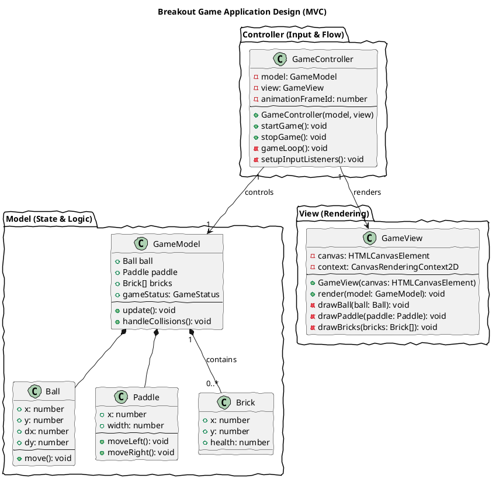
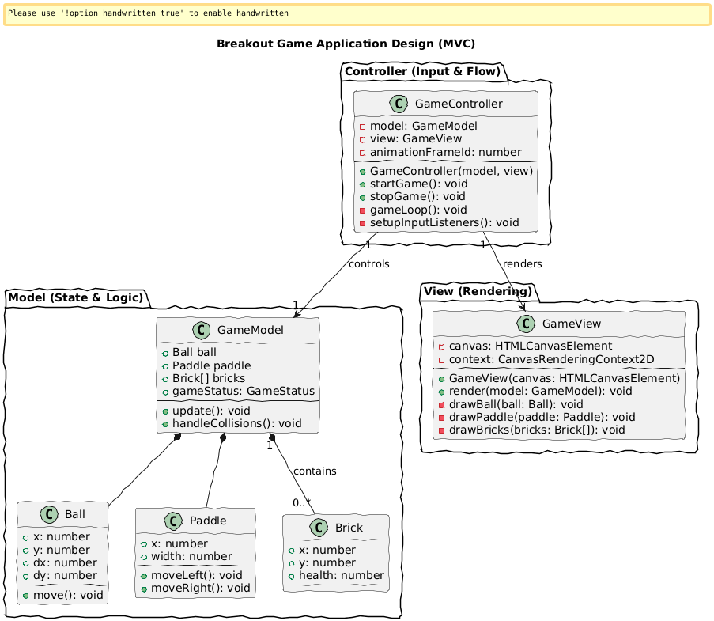

# Gemini Capability Testing

The purpose of this section is to provide a simple example of a web application done with the AI model of Gemini to see how well it performs making a whole web application from scratch by itself.

## Setup

**Prompt used:**

```
We will need to setup the environment where we will be working, so for instance I need you to tell me how to install all the things we need for the base of the project, as a guide, I'll tell you the technologies I'd like to use:

- npm
- typescript
- vite
- eslint
- jest
```

The LLM first suggested checking the installation of node (`node -v`) and npm (`npm -v`), and then initializing the project with vite using the command `npm create vite@latest`. Vite requested basic information, such as the project name, the framework, whether Typescript is used, etc. Once the project was successfully created, it suggested installing eslint with certain plugins that the model deemed optimal, as well as initializing eslint in the project with `npx eslint --init`. Finally, it suggested installing jest and ts-jest, as well as initializing them with `npx ts-jest config:init` and a code base for the proposed jest configuration file:

```js
// jest.config.js
module.exports = {
  preset: 'ts-jest',
  testEnvironment: 'jsdom', // Use 'jsdom' if testing browser features
  moduleFileExtensions: ['ts', 'tsx', 'js', 'jsx', 'json', 'node'],
  transform: {
    '^.+\\.(ts|tsx)$': 'ts-jest',
  },
  testMatch: ['**/__tests__/**/*.ts?(x)', '**/?(*.)+(spec|test).ts?(x)'],
};
```

So now that the project has been initialized, if we run the command `npm run dev`, it launches a base page created with the vite template.

## Application

**Prompt used:**

```
Second Step: Application Design

Now that we have a solid structure to work with, let's start designing, the application itself. My idea was to create a simple Breakout game in typescript code using the MVC pattern, so we need to structure the classes and modules we'll need to create the application, create a Class Diagram with PlantUML.
```

The model suggested the following class diagram:



### Compiled class diagram



## Code Implementation

**Prompt used:**

```
Third Step: Code

In the previous step we defined the basic structure of the application, now we'll build the code for the different files needed:

- index.html
- main.ts
- gameController.ts
- gameModel.ts
- gameView.ts
- ball.ts
- paddle.ts
- brick.ts

for files like index.html, we'll need some basic css code that you'll put in a css file (nothing too complex, basic css to make the page seem fancier), you can add and modify the files if needed, but you'll code each file step by step (remember that the .ts files are in the src directory)
```

First of all, the model suggested executing the next commands to modify the code structure:

```
# Create the src/view and src/controller directories
mkdir -p src/view src/controller

# Create the style.css file
touch style.css
```

> [!Warning] The model forgot to create the `src/model` directory, which is necessary for the project structure, so we had to create it manually.

Then, it provided the code for each of the files step by step, most of them without any error, only little mistakes like calling parameters that are never used, it defines that the `R` key is used to restart the game but it doesn't work like the other keybinds, lack of consistency on the documentation, etc. In general, the code is well structured, easy to read and understand, and it works pretty solid.

## Testing

**Prompt used:**

```
Fourth Step: Testing

For each code file is needed a test file to check that everything works as expected, so we'll use ts-jest to do that.
```

The model suggested to create the `__tests__` directory and generally test only the model files, since the controller and view are more difficult to test with jest:

```bash
mkdir -p src/__tests__/model
```

Then, it provided the code for each of the test files, but some of them had missing imports that had to be added manually. Also when trying to run the tests with `npm run test`, it failed because the `testEnvironment` property in the jest configuration file was missing and some other things that the model modified to make it work. After fixing those little issues, all the tests passed successfully.

## Final Result

The final result is a simple but functional Breakout game that can be played in the browser. The game includes features such as ball and paddle movement, brick collision detection, score tracking, and game over conditions. The application is structured using the MVC pattern, making it easy to maintain and extend in the future.


